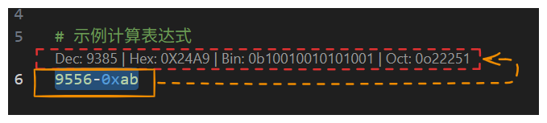

**FuzzyCal**
- 计算数字表达式：`(2+3*4)/5`, `sin(pi/6)`, `0xff + 42`。
- 进制转换：`FF -> dec`, `1010b -> hex`, `16#FF`, `base2 1010`，或直接输入 `255` / `0xFF` / `1010b`。

版本说明
- 当前版本：`1.0.1`（计划为功能迭代的最后一个大版本，后续如有需要仅做 bugfix）。
- 变更：
  - 优化选区识别优先级，优先把 `1010b/FF/0o777` 等识别为进制数字，避免被误判为表达式而不触发转换按钮。
  - 移除“纯 `0-7` 视作八进制”的启发式，避免把普通十进制串误判为八进制。

使用规则（重要）
- 选择优先级：当选中一段文本时，优先尝试“进制数字识别”，其后才按“表达式”计算。
- 表达式安全：仅允许白名单内的函数/常量；拒绝引号、反引号、反斜杠、分号等不安全字符。
- 前导零容错：
  - 在表达式里，若直接求值失败，会将形如 `0…` 的连续十六进制风格数字自动视为十六进制再尝试（例如：`000A + 1` 会按 `0x000A + 1` 计算，结果为 `11`）。
  - 纯数字且以 `0` 开头（如 `0123`）在“数值/进制模式”下也会被当作可转换的数字；解析时会倾向于按十六进制理解以避免 `000A` 报错。
  - 如需明确十进制，请去掉前导零或在“进制转换”中指定目标：`0123 -> dec`/`to 10`。

演示
- 下图展示了选中触发结果与侧边面板的使用方式。
  
  

使用方式：
- 运行命令：`FuzzyCal: 弹框计算器 / 进制转换`（或在编辑器中按下 `Ctrl+Shift+Alt+C`）。
- 若选中了一段文本，会自动作为输入预填。
- 结果列表中选择任一条，会自动复制到剪贴板。
- 新增：侧边面板编辑器：运行 `FuzzyCal: 打开侧边面板`（或 `Ctrl+Shift+Alt+F`），在侧边/分栏中打开一个小面板，可输入/编辑表达式或数字并实时查看结果。支持“跟随选中”自动同步当前选区内容。

选择触发：
- 当用鼠标选中一段“可计算的表达式”（通过安全校验）时，会在选中行的上方显示一排按钮（CodeLens），展示计算结果（如 Dec/Hex/Bin/Oct）。点击任一按钮即可复制该结果。
- 同样地，当选中“纯数字或常见进制写法”（如 `255`, `-42`, `0xFF`, `1010b`, `0o777`）时，也会在上方显示相应进制转换结果按钮。
- 为避免打扰，只有鼠标选择且较短（≤200 字符）的内容才会触发，且同一段文字不会重复弹出。
- 若未看到按钮，请确认 VS Code 设置中已启用 `Editor: CodeLens`。

CodeLens 操作：
- 两行左对齐布局：
  - 上一行显示结果按钮（Dec/Hex/Bin/Oct 或 Result）。
  - 下一行显示 `Expr: …` 与重置图标 `↺`。
- 点击 `Expr: …` 会弹出输入框以编辑表达式，确认后刷新上方结果。
- 点击 `↺` 将表达式恢复为最初从选区捕获的值，并刷新结果。

表达式支持：
- 运算符：`+ - * / % **`，以及 `^` 会被视为乘方（同 `**`）。
- 常用函数（以 `Math.*` 方式调用）：`sin, cos, tan, asin, acos, atan, atan2, pow, sqrt, abs, log(=ln), exp, min, max, floor, ceil, round, trunc`。
- 常量：`pi / PI`, `e / E`。
- 解析规则补充：表达式中混合不同进制的数字是允许的（如 `0x10 + 1010b + 8o`）；当出现前导零数字并导致首次求值失败时，会自动尝试按十六进制重试一次。

进制支持：
- 自动识别：`0x.., 0b.., 0o.., ..h, ..b, ..o, 10 进制`。
- 显式指定：`base16 FF`, `16#FF`。
- 目标进制：`FF -> dec`, `1010 -> hex`, `255 to 2`。
- 额外识别：
  - 仅由 `A-F0-9` 组成且包含至少一个字母的字符串，会按十六进制理解（如 `00FF`、`deadbeef`）。
  - 仅由 `0-1` 构成的字符串按二进制理解。
  - 以 `0` 开头的“十进制外观”数字（如 `0123`）会被视为可转换数值，通常按十六进制解释；需要十进制请写 `0123 -> dec`。

注意：
- 表达式中仅支持上面白名单中的函数/常量，避免执行任意代码。
- 大整数使用 `BigInt` 进行进制转换；浮点表达式结果仅展示十进制数值。

补充：
- 表达式中可混用不同进制数字：`0x.. / 0b.. / 0o..`、后缀 `..h / ..b / ..o`、`16#FF / base2 1010` 等写法会在计算前自动规范化为十进制常量。
- 更激进的选择识别：纯 `A-F0-9` 会按十六进制尝试解析；纯 `01` 视作二进制。不再对一般字母数字串尝试 36 进制解析。

命令一览：
- `FuzzyCal: 弹框计算器 / 进制转换`（`Ctrl+Shift+Alt+C`）
- `FuzzyCal: 打开侧边面板`（`Ctrl+Shift+Alt+F`）

侧边面板：
- 面板包含模式选择（表达式/进制）、输入框、计算按钮与结果列表。
- 勾选“跟随选中”后，编辑器中的选区内容会自动同步到面板并计算。
- 结果项带复制按钮，点击即可复制对应数值。
